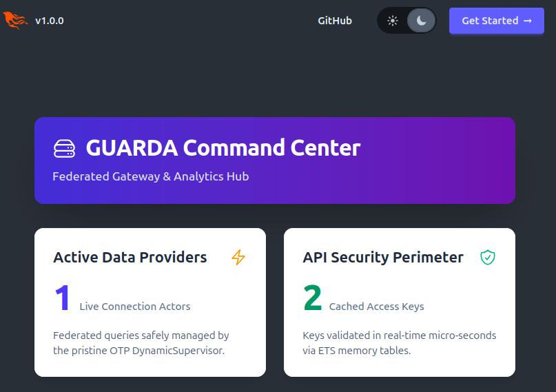

# GUARDA Tutorial: Federated Data Integration

Welcome to **GUARDA**, the high-performance federated data integration proxy. This tutorial walks you through the core use cases and how to leverage the system for distributed analytics.

## 1. Core Architecture

GUARDA acts as a unified middleware layer. Instead of moving all your data into a central data lake (ETL), you keep your data in its source systems (PostgreSQL, MySQL, MongoDB, REST APIs) and use GUARDA to query them in real-time.

### Key Concepts
- **Providers**: Isolated Erlang processes (Actors) that speak the native protocol of your backend databases.
- **ETS Caching**: In-memory security layer that validates API keys in micro-seconds.
- **Supervision**: A fault-tolerant hierarchy that ensures one slow query doesn't crash the entire gateway.

---

## 2. Use Case: Federated SQL Access

GUARDA allows you to treat multiple remote databases as a single integrated surface.

### Step 1: Configure Providers
In `config/runtime.exs`, define your backend connections:
```elixir
config :guarda, :providers, [
  %{id: :postgres_main, module: Guarda.Provider.Postgres, url: "postgres://..."},
  %{id: :mysql_legacy, module: Guarda.Provider.Mysql, url: "mysql://..."}
]
```

### Step 2: Querying through the Gateway
You can send a standardized JSON request to the GUARDA endpoint:
```bash
curl -X POST http://localhost:4000/api/query \
  -H "x-api-key: YOUR_SECRET_KEY" \
  -d '{"provider": "postgres_main", "query": "SELECT * FROM users LIMIT 10"}'
```

---

## 3. Use Case: Real-Time Analytics Dashboard

The **Command Center** (the dashboard you are currently viewing) provides a live view of the system health.



- **Active Data Providers**: Shows how many isolated connection processes are currently running.
- **API Security Perimeter**: Shows the number of authenticated researchers/apps currently cached in high-speed memory.

---

## 4. Use Case: Secure Institutional Access

If you are an institution providing data to external researchers:
1. **Issue a JWT or API Key**: Register the key in the GUARDA database.
2. **Isolation**: GUARDA will spawn a dedicated process for that researcher's session, ensuring they cannot impact other users' performance.
3. **Observability**: Monitor their query impact via the LiveView dashboard.

---

## 5. Development & Testing

To run the full integration suite and see federated queries in action:
```bash
# Start the mock backend containers
docker-compose up -d

# Run the integration tests
mix test test/guarda/integration/federation_test.exs
```

---

## 6. Observability & Process Isolation

A common question is: *"Why does my dashboard show 0 even when I am running tests or scripts?"*

### The "Isolation" Principle
In Elixir, every time you run a command like `mix test` or `mix run`, a **completely new and isolated BEAM instance** is started. 
- Connection actors created in `mix test` exist only within that test's instance.
- The dashboard running in `mix phx.server` is a different instance and cannot see the memory or processes of the test run.

### How to Observe Live Metrics
To see the dashboard metrics move, you must run your commands **inside the same instance** as the web server. 

1. **Start the server with an interactive shell**:
   ```bash
   iex -S mix phx.server
   ```

2. **Run commands in the same terminal**:
   While the server is running, you can type directly into the IEx prompt to manipulate the live state:
   ```elixir
   # This will immediately update the "API Security Perimeter" count
   Guarda.APIKeys.register_key("demo_key", %{user: "Alice"})

   # This will update the "Active Data Providers" count
   Guarda.ProviderSupervisor.start_provider(Guarda.Provider.Postgres, [hostname: "localhost", database: "guarda_test_pg", username: "postgres", password: "postgres_password"])
   ```

---

For more details, visit the [official repository](https://github.com/KathiraveluLab/GUARDA).
